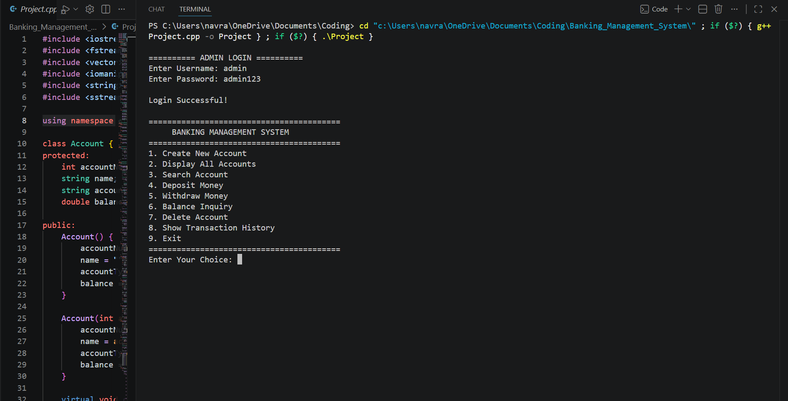
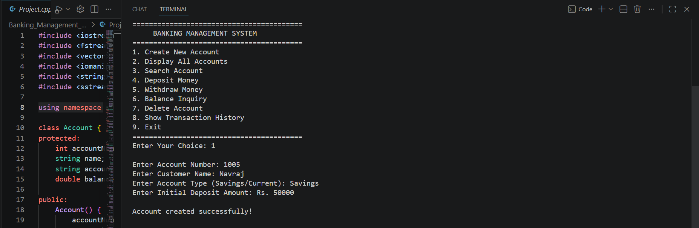
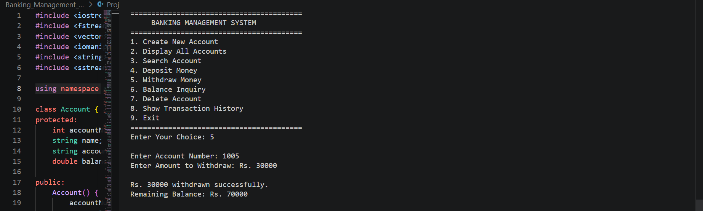
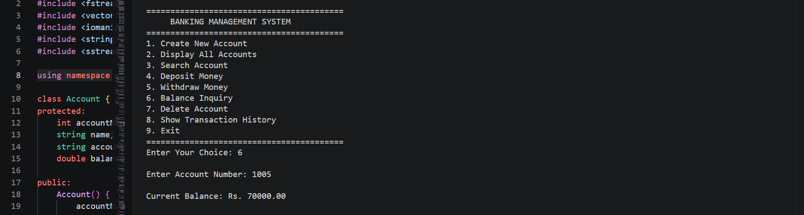
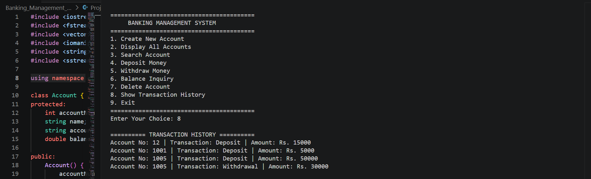

# Banking Management System

A console-based Banking Management System developed using C++, Object-Oriented Programming, and File Handling.

## Features
- Account Creation
- Deposit & Withdrawal
- Balance Inquiry
- Transaction History
- Admin Login
- ATM Simulation
- Interest Calculator
- File Handling
- Exception Handling

## Tech Stack
- C++
- OOP
- File Handling
- STL

## Screenshots

### Main Menu


### Account Creation


### Deposit Money


### Withdrawal


### Balance Inquiry


### Transaction History


## How to Run

```bash
g++ Project.cpp -o banking
./banking

Then push again:

```bash
git add .
git commit -m "Added README"
git push


